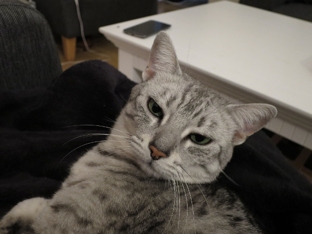

# Exercise 1: Getting started

## Links

[RMarkdown cheatsheet](http://rmarkdown.rstudio.com/authoring_basics.html)

[The course description page](https://courses.helsinki.fi/78995/115961424)

[The actual course page](https://mooc.helsinki.fi/course/view.php?id=52)

My course diary (this page) is located at https://hennake.github.io/IODS-project/.

My GitHub repository for this course is located at https://github.com/hennake/IODS-project.

## Why am I here?

Because Data Science is cool, and Open Data Science is even more so!  
I'm quite familiar with R (5 years of experience), but I'd also like to learn how to use GitHub and RMarkdown. 

## What did I do?

1. Created a GitHub account and got myself the course project template.
2. Tried to work with Git on my business laptop.
3. Bought and installed a new laptop, as my old one was broken, and I couldn't connect to GitHub on my business laptop.
4. Installed R and RStudio.
5. Installed GitHub Desktop and cloned the course repository.
6. Wrote this description, set up my course diary and changed its theme to "paper".
7. Created and knitted README.Rmd.
8. Uploaded the changes to GitHub.

## What did I learn?

How to get started with Git, GitHub and RMarkdown.

  
## Obligatory cat pic

  

